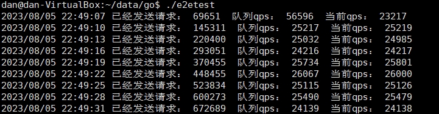

# 简单服务框架

## 协议生成
1. 下载协议，放置pb目录
2. 创建pb_gen目录
```bash
protoc --go_out=./pb_gen  --go-grpc_out=./pb_gen  pb/*.proto
```

## 发布
### windows编linux可执行文件
1. cd .\build\
2. .\build-linux.bat

## 教程
### 创建新模块
1. .\build\build.bat 生成windows版本的工具 
2. 在modules目录创建一个模块目录，比如example
3. 执行 .\code-generator.exe来自动生成example模块代码

### 配置文件
1. 模块相关的配置： [modules.yaml](__output%2Fconfigs%2Fmodules.yaml)
2. 词库相关配置：[__output](__output)

### 例子
1. 接口形式的模块: 参考[nlp](modules%2Fnlp)模块（只暴露接口，不对外公开实现细节）
2. mvc形式模块: 参考[cache](modules%2Fcache)模块（只在model里写业务逻辑，controller作为网络消息处理）
3. 事件处理模块: 参考[metric](modules%2Fmetric)模块 （controller作为事件处理）
4. 压力测试：参考[e2etest](cmd%2Fe2etest)
5. 定时器: [时间格式](https://pkg.go.dev/github.com/robfig/cron/v3)跟crontab一样，例子参考[model.go](modules%2Fanalyzer%2Finternal%2Fmodel.go)

## 简单测试
1. 启动 [python文本分类服务](http://192.168.4.210/dmm-backend/easy-text-classifier)
2. 启动本服务(./v2)
3. 启动 ./e2etest.exe，以并发100，qps5000+的速度请求服务器
4. 打开 [statsviz](http://127.0.0.1:8079/debug/statsviz/) 查看统计


## metric
TODO
1. 往prometheus grafana里送数据，可视化
2. 更多的数据
打开 http://127.0.0.1:8080/metric

二次开发参考[metric](modules%2Fmetric)


## 测试
TODO
## 压力测试
未优化linux，并发150，qps 25000，发送8655777次请求：  


cpu和内存：  


延迟分布：99.5%的请求延迟在5ms以下：  

## 单元测试
TODO
## 限流、熔断和降级
TODO  
qps限制：python服务，qps太高就会出先cpu过高，redis也一样得qps控制  
redis和python：服务异常得熔断，直接返回，避免本侧的请求堆积，内存涨起来  
如果本机服务的负载很大：可以考虑降级，直接返回true  

## profile、trace和stat
性能分析，内存分析好过cpu分析，建议在发布前压力测试时分析，可以在生产环境的机器上进行分析和追踪，如果内存
普遍都不复用，那么GC的频率和延迟可能都会很高，阻塞要看情况分析，添加pprof的代码参考[network](pkg%2Fnetwork)
### profile
打开 http://127.0.0.1:8080/debug/pprof/ 分类代表啥意思，完整的可以看官方文档

### profile 控制台例子
```bash
# 内存分配分析
go tool pprof --alloc_objects  http://localhost:8080/debug/pprof/heap

## 10s的CPU时间消耗分析
go tool pprof http://localhost:8080/debug/pprof/profile?seconds=10
```

查看消耗前10  

```bash
flat：当前函数自身消耗  
flat%：当前函数自身消耗的比例   
sum%：累计到当前函数的消耗和比例       
cum：当前函数以及子函数的消耗   
cum%：当前函数以及子函数的消耗比例
```
```bash

PS E:\github\go-text-filter-server> go tool pprof --alloc_objects  http://localhost:8080/debug/pprof/heap                       
Fetching profile over HTTP from http://localhost:8080/debug/pprof/heap
Saved profile in C:\Users\24707\pprof\pprof.___go_build_go_text_filter_server_cmd_v2.exe.alloc_objects.alloc_space.inuse_objects.inuse_space.012.pb.gz
File: ___go_build_go_text_filter_server_cmd_v2.exe
Build ID: C:\Users\24707\AppData\Local\JetBrains\GoLand2023.2\tmp\GoLand\___go_build_go_text_filter_server_cmd_v2.exe2023-08-12 21:18:09.0289114 +0800 CST
Type: alloc_objects
Time: Aug 13, 2023 at 2:48am (CST)
Entering interactive mode (type "help" for commands, "o" for options)
(pprof) top 10
Showing nodes accounting for 138899709, 55.81% of 248881666 total
Dropped 144 nodes (cum <= 1244408)
Showing top 10 nodes out of 125
      flat  flat%   sum%        cum   cum%
  32870118 13.21% 13.21%   32874303 13.21%  regexp.(*Regexp).replaceAll
  26689541 10.72% 23.93%   26689541 10.72%  github.com/kamilsk/tracer.(*Trace).Start
  13943347  5.60% 29.53%   13943347  5.60%  github.com/prometheus/client_golang/prometheus.constrainLabelValues
  12784611  5.14% 34.67%   12784611  5.14%  net/textproto.readMIMEHeader
  12488081  5.02% 39.69%   30832902 12.39%  go-text-filter-server/modules/analyzer/internal.(*Model).CleanInvalidCharset
  11065972  4.45% 44.13%   43940275 17.66%  regexp.(*Regexp).ReplaceAllString
   9706697  3.90% 48.03%  193189821 77.62%  go-text-filter-server/pkg/network/internal.GinWitheRequestId.func1
   6777571  2.72% 50.76%   31185327 12.53%  net/http.(*conn).readRequest
   6443751  2.59% 53.35%    6443751  2.59%  net/http.Header.Clone (inline)
   6130020  2.46% 55.81%    6130020  2.46%  strings.(*Builder).grow (inline)
```

查看函数分配详情
```bash
(pprof) list CleanInvalidCharset  
Total: 248881666
ROUTINE ======================== go-text-filter-server/modules/analyzer/internal.(*Model).CleanInvalidCharset in E:\github\go-text-filter-server\modules\analyzer\internal\model.go
  12488081   30832902 (flat, cum) 12.39% of Total
         .          .    136:func (model *Model) CleanInvalidCharset(ctx context.Context, content string, cleanEmoji bool) (string, []string) {
         .    4290348    137:   defer ctxhelper.FetchTrace(ctx).Start().Stop()
         .          .    138:
         .          .    139:   charset := configs.GetCharset()
         .          .    140:   if charset == nil || len(charset) == 0 {
         .          .    141:           return content, nil
         .          .    142:   }
         .          .    143:
         .          .    144:   // 全角转半角
         .          .    145:   oldContent := content
         .    8297580    146:   content = width.Narrow.String(content)
         .          .    155:
         .          .    156:   // 去除不在字符集里的字符
      6620       6620    157:   runesContent := []rune(content)
         .          .    158:   var hitCharset []string
   4109289    4109289    159:   retContent := make([]rune, 0, len(runesContent))
         .          .    160:   for _, char := range runesContent {
         .          .    161:           if _, ok := charset[char]; !ok {
   4613060    4613060    162:                   hitCharset = append(hitCharset, string(char))
         .          .    163:                   continue
         .          .    164:           }
         .          .    165:
         .          .    166:           retContent = append(retContent, char)
         .          .    167:   }
         .          .    168:
   3759112    3759112    169:   return string(retContent), hitCharset
         .          .    170:}
         .          .    171:
         .          .    172:// AnalyzeCN 分析中文 （比如：你妈）
         .          .    173:func (model *Model) AnalyzeCN(ctx context.Context, content string, dangerous bool) (bool, string) {
         .          .    174:   defer ctxhelper.FetchTrace(ctx).Start().Stop()

```

### profile 网页例子
先安装[graphviz](https://graphviz.org/download/)，在环境变量加上graphviz:  

```bash
# 内存分配分析
go tool pprof -http="127.0.0.1:8082" --alloc_objects  http://localhost:8080/debug/pprof/heap

## 10s的CPU时间消耗分析
go tool pprof -http="127.0.0.1:8082" "http://localhost:8080/debug/pprof/profile?seconds=10"
```
调用关系图


消耗前30


火焰图


代码分析


### trace
运行时的事件追踪
```bash
PS E:\github\go-text-filter-server> curl "http://localhost:8080/debug/pprof/trace?seconds=5" -o trace.out
PS E:\github\go-text-filter-server> go tool trace .\trace.out
```


## 慢查询和进程内trace
参考 [model.go](modules%2Fanalyzer%2Finternal%2Fmodel.go), 在函数里加:
```golang
func (model *Model) F(ctx context.Contextn) bool {
	// 添加追踪
    defer ctxhelper.FetchTrace(ctx).Start().Stop()
	
	// 其他功能实现
	// ......
}
```

日志里就会出现，调用栈的耗时:
```json
{"L":"WARN","T":"2023-07-30 14:42:36.948","C":"E:/github/go-text-filter-server/modules/say/internal/controller.go:44","M":"slow call","module":"analyzer","function":"analyze","requestId":"48e1749f45e593d7da716fc80dbd9272c8b985b574d865f7243d528c0d27b92c","trace":"allocates at call stack: 0, detailed call stack:\n\tcall internal.GinWitheRequestId.func1 [48e1749f45e593d7da716fc80dbd9272c8b985b574d865f7243d528c0d27b92c]: 5.043792s, allocates: 0\n\tcall internal.(*Model).AllowWhitelist: 0s, allocates: 0\n\tcall internal.(*Model).CleanInvalidCharacter: 0s, allocates: 0\n\tcall internal.(*Model).AnalyzeByDanger: 0s, allocates: 0\n\tcall internal.(*Model).AnalyzeEN: 0s, allocates: 0\n\tcall internal.(*Model).AnalyzeCN: 0s, allocates: 0\n\tcall internal.(*Model).AnalyzeByNormal: 0s, allocates: 0\n\tcall internal.(*Model).AnalyzeEN: 0s, allocates: 0\n\tcall internal.(*Model).AnalyzeCN: 0s, allocates: 0\n\tcall internal.(*Model).AnalyzeByCacheWithTimeout: 3.0056157s, allocates: 0\n\tcall internal.(*Model).AnalyzeByNLPWithTimeout: 2.0378617s, allocates: 0"}
```
```bash
allocates at call stack: 0, detailed call stack:
	call internal.GinWitheRequestId.func1 [a975f0e155c3643a146b94dd5d387cd73f5aac85d0a5b9db77f4449e77aa0bd8]: 5.0606849s, allocates: 0
	call internal.(*Model).AllowWhitelist: 0s, allocates: 0
	call internal.(*Model).CleanInvalidCharacter: 0s, allocates: 0
	call internal.(*Model).AnalyzeByDanger: 0s, allocates: 0
	call internal.(*Model).AnalyzeEN: 0s, allocates: 0
	call internal.(*Model).AnalyzeCN: 0s, allocates: 0
	call internal.(*Model).AnalyzeByCacheWithTimeout: 3.0070433s, allocates: 0
	call internal.(*Model).AnalyzeByNLPWithTimeout: 2.0532953s, allocates: 0
	call internal.(*Model).AnalyzeByNormal: 0s, allocates: 0
	call internal.(*Model).AnalyzeEN: 0s, allocates: 0
	call internal.(*Model).AnalyzeCN: 0s, allocates: 0
```

## 分布式trace
TODO

## 配置加载
TODO   
自动轮询远端仓库判断文件是否发生变化，有就加载  

手动加载：  
    

## 磁盘io阻塞导致慢查询
生产环境配置改成production，只打印error信息哈，磁盘对于系统调用来说总是就绪，所以就算磁盘请求排队了也是一查就是就绪，go会在这种状态下生成很多线程，后续的请求不再卡在上面，但是这个请求就会被挂起好久  
生产环境走kafka，不打本地日志  


## 日志
自动切割，zap的error等级的日志会输出堆栈，所以可以在关键位置输出堆栈

## 告警和日志扫描
TODO prometheus grafana zap


## 文档
TODO swagger页面接口
TODO godoc